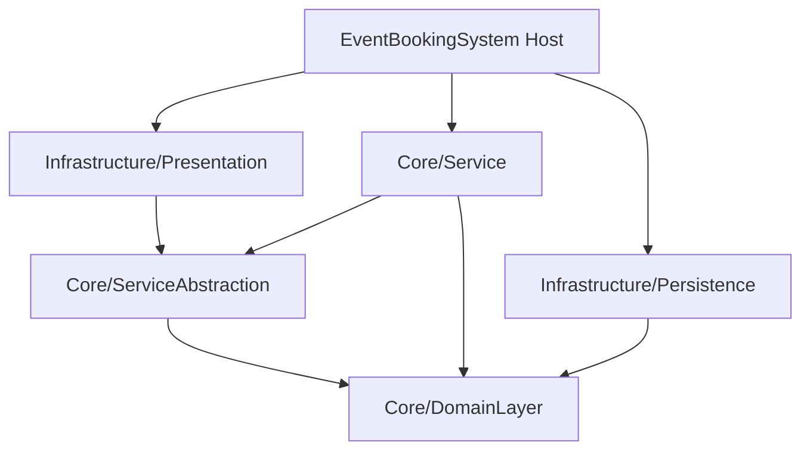

# EventBookingSystem


An enterprise-grade Event Booking System built using .NET 8 and Clean Architecture principles. It emphasizes a robust separation of concerns, decoupling the domain model from infrastructure and presentation concerns to ensure scalability and maintainability.

## 🏗️ Architecture

This project strictly adheres to **Clean Architecture / Onion Architecture** paradigms, structured into multiple layers.



## 📂 Project Structure

| Layer | Project | Description |
|---|---|---|
| **Domain** | `Core/DomainLayer` | Core business entities and domain models. |
| **Service Interfaces** | `Core/ServiceAbstraction` | Contracts for application business logic. |
| **Service Implementation** | `Core/Service` | Concrete implementation of business rules. |
| **Data Access** | `Infrastructure/Persistence` | EF Core 8 DbContext, Repositories, and SQL Server configurations. |
| **API/Controllers** | `Infrastructure/Presentaion` | REST endpoints and HTTP request/response handling. |
| **Shared** | `Shared` | Common utilities, helpers, and DTOs. |
| **Host** | `EventBookingSystem` | The startup project that composes the DI container and middleware pipeline. |

## 🚀 Getting Started

### Prerequisites
- [.NET 8 SDK](https://dotnet.microsoft.com/download/dotnet/8.0)
- SQL Server

### Installation & Execution

```bash
# 1. Clone the repository
git clone https://github.com/OmarAlfar0uk/EventBookingSystem.git

# 2. Navigate to the project root
cd EventBookingSystem

# 3. Restore dependencies
dotnet restore

# 4. Run the application
dotnet run --project EventBookingSystem
```

---

## 👨‍💻 Author

**Omar Alfarouk**
- GitHub: [OmarAlfar0uk](https://github.com/OmarAlfar0uk)
- LinkedIn: [omar-alfarouk-252471251](https://www.linkedin.com/in/omar-alfarouk-252471251/)
- Email: [omaralfarouk646@gmail.com](mailto:omaralfarouk646@gmail.com)
