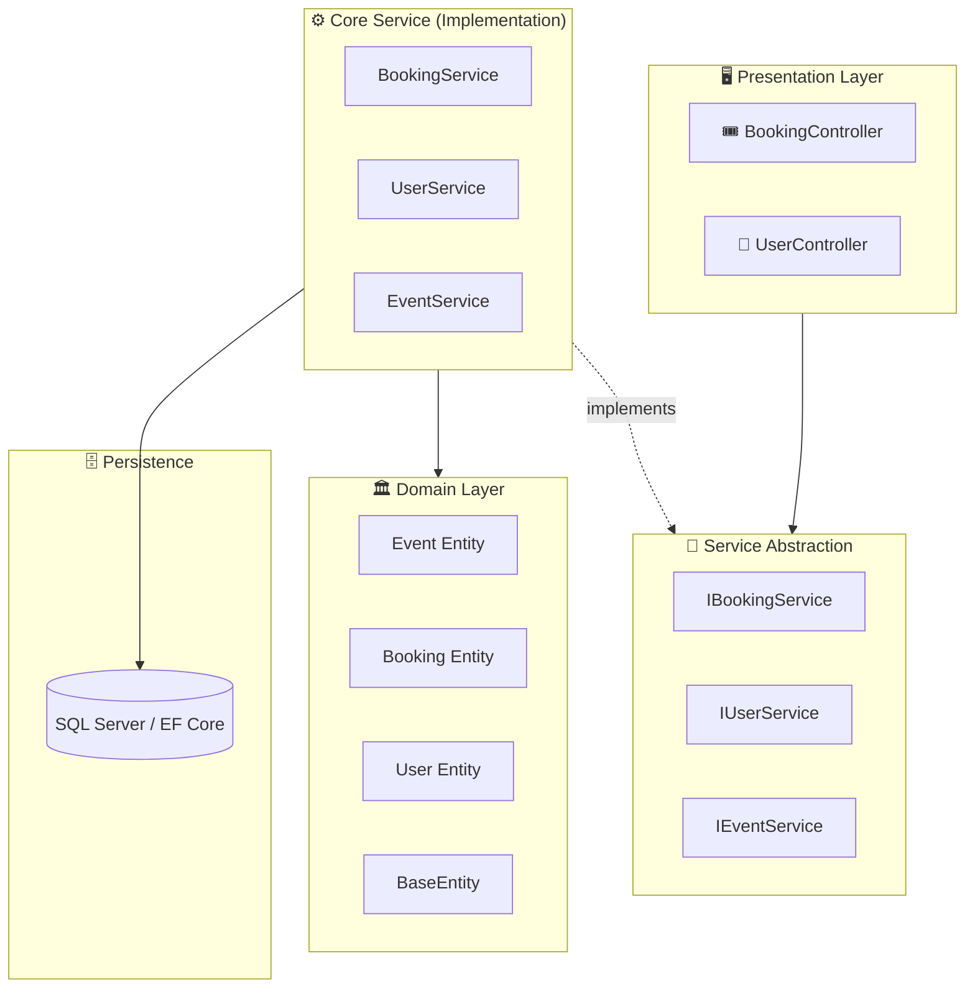

<div align="center">

# 🎟️ Event Booking System
### Enterprise Clean Architecture Platform for Event Management & Ticket Reservation

[](https://dotnet.microsoft.com/)
[](https://learn.microsoft.com/en-us/dotnet/csharp/)
[](#-system-architecture)
[](LICENSE)
[](https://github.com/OmarAlfar0uk)

<p align="center">
  <a href="#-key-features">Key Features</a> •
  <a href="#-system-architecture">System Architecture</a> •
  <a href="#-tech-stack">Tech Stack</a> •
  <a href="#-project-structure">Project Structure</a> •
  <a href="#-getting-started">Getting Started</a> •
  <a href="#-api-endpoints">API Endpoints</a> •
  <a href="#-author">Author</a>
</p>

</div>

---

## 📌 Executive Overview

**Event Booking System** is an enterprise event orchestration and reservation engine engineered with modern Clean Architecture principles. It facilitates event scheduling, seat availability tracking, user reservations, and ticket status life-cycles. Designed with complete decoupling between domain business logic, service abstractions, and presentation controllers, the system guarantees high resilience and easy extensibility.

> [!NOTE]
> Adheres strictly to **Clean Architecture** with four distinct layers: **Core.DomainLayer**, **Core.ServiceAbstraction**, **Core.Service**, and **Infrastructure.Presentation**.

---

## ✨ Key Features

| ⚡ Feature | 💡 Description | 🛠 Engineering Detail |
|---|---|---|
| **🎫 Event Lifecycle Management** | Create, schedule, update, and manage public & private events | Domain validation preventing over-booking and invalid dates |
| **🪑 Seat & Ticket Reservation** | Real-time booking pipeline with concurrency safeguards | Transactional booking workflow in `BookingService` |
| **👤 User Account Management** | User registration, authentication, and booking history | Clean separation of user identity from booking logic |
| **🧩 Decoupled Architecture** | Strict dependency inversion between contracts and services | Clean Architecture with `ServiceAbstraction` interfaces |
| **📊 RESTful Presentation** | Dedicated Web API controllers for bookings and users | ASP.NET Core presentation layer decoupled from infrastructure |

---

## 🏛 System Architecture



---

## ⚡ Tech Stack

| Category | Technology | Purpose |
|---|---|---|
| **Platform** |   | Core backend runtime and modern C# idioms |
| **Architecture** |  | Separation of domain entities, abstractions, and services |
| **Data & ORM** |   | Relational persistence and schema migrations |
| **Documentation** |  | Interactive API exploration and testing |

---

## 📂 Project Structure

```text
EventBookingSystem/
├── Core/
│   ├── DomainLayer/             # Enterprise Entities (Event, Booking, User, BaseEntity)
│   ├── Service/                 # Business logic implementation (BookingService, EventService, UserService)
│   └── ServiceAbstraction/      # Service interfaces & contracts (IBookingService, etc.)
├── Infrastructure/
│   └── Presentation/            # Presentation API Controllers (BookingController, UserController)
├── EventBookingSystem/          # Host application, Startup DI configuration & middlewares
│   ├── Program.cs
│   └── appsettings.json
└── EventBookingSystem.sln
```

---

## 🚀 Getting Started

### Prerequisites
- [.NET 8.0 SDK](https://dotnet.microsoft.com/download/dotnet/8.0)
- SQL Server (LocalDB or Docker)

### Installation & Run

1. **Clone repository:**
   ```bash
   git clone https://github.com/OmarAlfar0uk/EventBookingSystem.git
   cd EventBookingSystem
   ```

2. **Configure Connection String in `appsettings.json`:**
   ```json
   {
     "ConnectionStrings": {
       "DefaultConnection": "Server=localhost;Database=EventBookingDb;Trusted_Connection=True;TrustServerCertificate=True;"
     }
   }
   ```

3. **Launch the Web API:**
   ```bash
   dotnet run --project EventBookingSystem/EventBookingSystem.csproj
   ```

---

## 📖 API Endpoints

| Method | Endpoint | Description |
|---|---|---|
| `GET` | `/api/Booking` | Retrieve all active bookings |
| `POST` | `/api/Booking` | Reserve tickets for an event |
| `GET` | `/api/Booking/{id}` | Get reservation confirmation details |
| `DELETE` | `/api/Booking/{id}` | Cancel an existing reservation |
| `GET` | `/api/User` | List registered users |
| `POST` | `/api/User` | Register a new attendee or organizer |

---

## 👨‍💻 Author

**Omar Alfarouk**  
*Full-Stack .NET & Software Engineer*  

- 🌐 **GitHub:** [@OmarAlfar0uk](https://github.com/OmarAlfar0uk)
- 💼 **LinkedIn:** [omar-alfarouk](https://www.linkedin.com/in/omar-alfarouk-252471251/)
- 📧 **Email:** [omaralfarouk646@gmail.com](mailto:omaralfarouk646@gmail.com)

---

<div align="center">
  <sub>Built with ❤️ by Omar Alfarouk. Licensed under the <a href="LICENSE">MIT License</a>.</sub>
</div>
